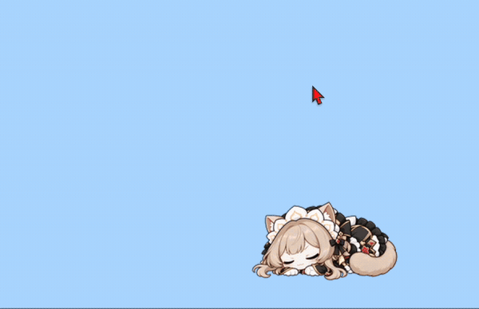
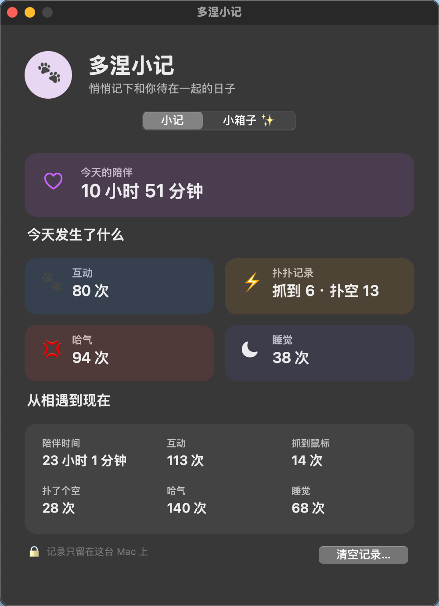
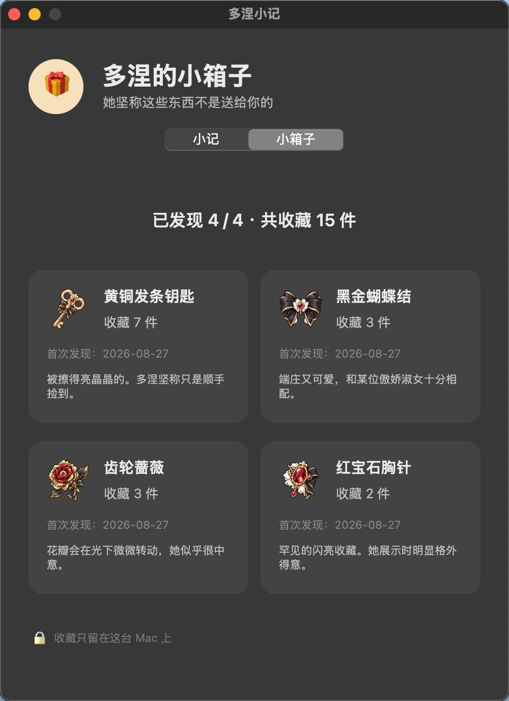

# 哈气桑多涅桌面宠物

一只会在桌面上散步、观察鼠标、扑向鼠标，还会哈气、得意和睡觉的桑多涅小猫。

> [!IMPORTANT]
> 这是非官方、非商业的同人项目，与角色原权利方不存在隶属或授权关系。代码与美术素材适用不同的权利说明，详见 [LICENSE](LICENSE) 和 [ASSET_NOTICE.md](ASSET_NOTICE.md)。

## 她会做什么

<table>
  <tr>
    <td align="center" width="50%">
       
      <strong>挥爪回应</strong> 
      点击她，她会抬起小爪回应你。
    </td>
    <td align="center" width="50%">
       
      <strong>生气哈气</strong> 
      连续逗她或者让她扑空，她会不耐烦地哈气。
    </td>
  </tr>
  <tr>
    <td align="center" width="50%">
       
      <strong>捕猎成功</strong> 
      扑到鼠标后，她会露出得意脸并说“多涅多涅~”。
    </td>
    <td align="center" width="50%">
       
      <strong>睡觉与唤醒</strong> 
      一分钟没有互动，她会安静睡下；靠近或点击即可唤醒。
    </td>
  </tr>
</table>

### 扑向鼠标

  

她不只是循环播放动画。待机时，她会看向鼠标所在的方向；在她附近快速来回晃动鼠标，她会先盯住目标、短暂蓄力，然后真的横向扑过去。扑到后会得意，扑空则会生气哈气。

### 多涅小记

  

“多涅小记”会记录今日与累计的陪伴时间、互动次数、扑扑结果、哈气和睡觉次数。桑多涅偶尔还会悄悄翻出一件小东西给你看；发现过的物品会收进“小箱子”，记录收藏数量和第一次发现的日期。

  

所有记录只保存在当前电脑，不会上传，也可以随时手动清空。

## 下载与安装

前往仓库的 [Releases](https://github.com/YapAmbition/Sandrone-Pet/releases/latest) 页面，根据自己的系统下载对应文件：

- **macOS 用户**：下载 `Hissy-Sandrone-macOS.zip`。
- **Windows 用户（推荐）**：下载 `Hissy-Sandrone-Windows-Setup-版本号-x64.exe`，这是正常安装版。
- **Windows 用户（免安装）**：下载 `Hissy-Sandrone-Windows-Portable-版本号-x64.exe`，这是绿色便携版，下载后可以直接运行。

不要下载 GitHub 自动生成的 `Source code`，那是源代码，不是可以直接运行的应用。

### macOS 安装

解压 `Hissy-Sandrone-macOS.zip` 后，将 `哈气桑多涅.app` 拖入“应用程序”文件夹，然后双击打开。

### Windows 安装

- 下载正常安装版后，双击安装程序，按照提示完成安装。
- 下载绿色便携版后，无需安装，双击 `.exe` 文件即可运行。

### macOS 拒绝打开时

当 macOS 提示“无法验证开发者”或“无法检查是否包含恶意软件”时：

1. 确认应用下载自本仓库的 Releases 页面。
2. 在 Finder 中右键点击 `哈气桑多涅.app`，选择“打开”，再在弹窗中确认“打开”。
3. 如果仍然被拦截，进入“系统设置 → 隐私与安全性”，在安全提示旁点击“仍要打开”，然后按系统提示确认。

通常只需在首次启动时完成上述操作，无需关闭 macOS 的系统安全功能。

## 怎么和她互动

| 操作 | 她的反应 |
| --- | --- |
| 单击宠物 | 挥爪回应 |
| 双击宠物 | 按当前体型对应的高度跳起来 |
| 短时间连续单击三次 | 不耐烦地哈气，并显示“哈?~~” |
| 拖动宠物 | 把她放到桌面上的其他位置 |
| 在附近快速来回晃动鼠标 | 盯住鼠标、蓄力并扑过去 |
| 一分钟没有直接互动 | 当前动作结束后睡觉 |
| 睡着后点击或拖动 | 立即醒来 |
| 鼠标离开后重新靠近并短暂停留 | 慢慢醒来 |

## 菜单里可以调整什么

点击 macOS 菜单栏或 Windows 系统托盘中的宠物图标，可以打开全部设置；右键点击宠物则可以快速使用得意、哈气、睡觉、显示模式和活动性等常用选项。

完整菜单提供：

- 手动触发挥爪、跳跃、得意、哈气和睡觉。
- 选择默认、活泼或安静三种活动性。
- 调整宠物大小，或让她回到屏幕右下角。
- 选择始终显示、隐藏宠物或进入全屏后自动隐藏。
- 开启或关闭自动扑向鼠标。
- 开启点击穿透，避免宠物挡住下面的窗口操作。
- 设置登录系统时自动启动。
- 打开“多涅小记”，查看今日与累计的陪伴记录，以及她找到的物品收藏。
- 打开离线使用帮助，或者退出应用。

开启“鼠标点击穿透”后，将无法直接点击宠物；可以从 macOS 菜单栏或 Windows 系统托盘中的宠物图标再次关闭。宠物大小、活动性、显示方式和自动扑击开关都会被记住。

## 活动性

- **默认**：每个自主动作后待机约 3～6 秒，再随机决定下一步做什么。
- **活泼**：每个自主动作后待机约 1.5～3 秒，会更快开始下一次活动。
- **安静**：不主动活动，但仍会看向鼠标、响应互动和睡觉。

## 系统要求

- **macOS**：macOS 13 或更新版本，支持 Apple Silicon 和 Intel Mac。
- **Windows**：64 位 Windows 10 22H2 或 Windows 11。
